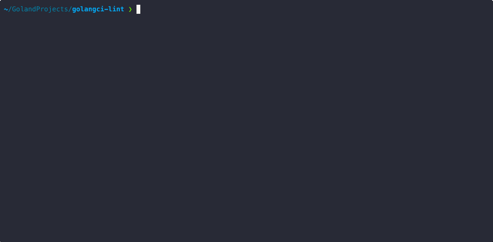

# modup

[](https://github.com/chaindead/modup/releases)
[](https://github.com/chaindead/modup/actions/workflows/release.yml)
[](https://pkg.go.dev/github.com/chaindead/modup)
[](https://goreportcard.com/report/github.com/chaindead/modup)
[](./LICENSE)


## What is it?

Clean terminal UI that scans your Go modules and helps you update selected dependencies intentionally. Built with Bubble Tea, it's responsive, fast, and pleasant to use right in your terminal.

- Scans dependencies and shows where updates are available.
- Lets you pick exactly which modules to update.
- Applies updates one by one with clear, visual progress.

Just [install](#usage) and run `modup` in project root



## Install

### Homebrew

```bash
brew install chaindead/homebrew-tap/modup
```

### Linux

<details>

> **Note:** The commands below install to `/usr/local/bin`. To install elsewhere, replace `/usr/local/bin` with your preferred directory in your PATH.

First, download the archive for your architecture:

```bash
# For x86_64 (64-bit)
curl -L -o modup.tar.gz https://github.com/chaindead/modup/releases/latest/download/modup_Linux_x86_64.tar.gz

# For ARM64
curl -L -o modup.tar.gz https://github.com/chaindead/modup/releases/latest/download/modup_Linux_arm64.tar.gz
```

Then install the binary:

```bash
# Extract the binary
sudo tar xzf modup.tar.gz -C /usr/local/bin

# Make it executable
sudo chmod +x /usr/local/bin/modup

# Clean up
rm modup.tar.gz
```
</details>

### Go Install (from sources)

Requires Golang 1.24+

```bash
go install github.com/chaindead/modup@latest
```

## Usage

Run inside a Go project:

```bash
modup
```

## Alternatives

- https://github.com/oligot/go-mod-upgrade — interactive module updates via browser/CLI
- https://github.com/psampaz/go-mod-outdated — report of outdated modules
- https://github.com/icholy/gomajor — discover available major updates
- Renovate Bot, Dependabot — automated dependency update PRs
- Built-ins: `go list -m -u all`, `go get -u` — basic but less controlled

